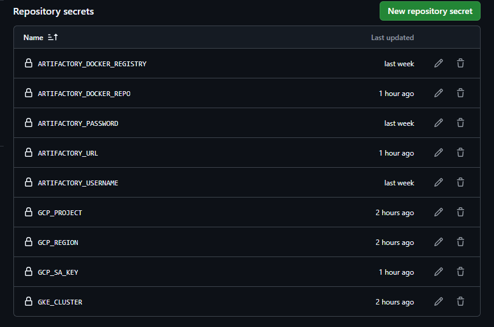

java -version

mvn -v

mvn spring-boot:run

Microservice1 => http://localhost:8081/greet

Microservice2 => http://localhost:8082/users/users1

Microservice3 => http://localhost:8083/products - Use Postman or CURL Command 

curl -X POST http://localhost:8083/products \
-H "Content-Type: application/json" \
-d '{
  "id": 1,
  "name": "Sample Product",
  "price": 19.99
}'

Validate Arifcatory Repo Access 
curl -u your-username:your-password https://testcicdvs.jfrog.io/artifactory/vsrepo-libs-release

Create Image and Push 

mvn clean package for each microservice

docker build -t microservice1:latest .
docker build -t microservice2:latest .
docker build -t microservice3:latest .

To test the images, run them as containers:

docker network create microservices-network

docker run -d --name microservice1-container --network microservices-network -p 8081:8081 microservice1:latest
docker run -d --name microservice2-container --network microservices-network -p 8081:8081 microservice2:latest
docker run -d --name microservice3-container --network microservices-network -p 8081:8081 microservice3:latest

docker ps

Test => curl http://localhost:8081/greet

docker login https://testcicdvs.jfrog.io/artifactory/api/docker/vs-docker-repo -u sweetpsharma86@gmail.com -p <<Password>>

https://testcicdvs.jfrog.io/artifactory/api/docker/vs-docker-repo

docker login -usweetpsharma86@gmail.com testcicdvs.jfrog.io

Tag the images with the repository name

docker tag microservice1:latest testcicdvs.jfrog.io/vs-docker-repo/microservice1:3.0.0
docker tag microservice2:latest testcicdvs.jfrog.io/vs-docker-repo/microservice2:3.0.0
docker tag microservice3:latest testcicdvs.jfrog.io/vs-docker-repo/microservice3:3.0.0

Push the images

docker push testcicdvs.jfrog.io/vs-docker-repo/microservice1:3.0.0
docker push testcicdvs.jfrog.io/vs-docker-repo/microservice2:3.0.0
docker push testcicdvs.jfrog.io/vs-docker-repo/microservice3:3.0.0

Pull the images

docker pull testcicdvs.jfrog.io/vs-docker-repo/microservice1:3.1.0
docker pull testcicdvs.jfrog.io/vs-docker-repo/microservice2:3.1.0
docker pull testcicdvs.jfrog.io/vs-docker-repo/microservice3:3.1.0

run the image in container directly from artifactory 

docker run -d --name microservice1-container --network microservices-network -p 8081:8081 testcicdvs.jfrog.io/vs-docker-repo/microservice1:3.0.0

docker run -d --name microservice2-container --network microservices-network -p 8082:8082 testcicdvs.jfrog.io/vs-docker-repo/microservice2:3.0.0

docker run -d --name microservice3-container --network microservices-network -p 8083:8083 testcicdvs.jfrog.io/vs-docker-repo/microservice3:3.0.0

Deploy locally all the micoroservices using docker-compose.yml file

docker-compose up -d

docker-compose down 

Manual Steps before create GKE cluster

Step 1 - Create an account on GCP and create a Project ID

Step 2 - Enable API

  1. Compute Engine API
  2. Kubernetes Engine API

Step 3 - Create a Service account and assign 3 roles

  1. Compute Admim
  2. Kubernetes Engnie Admin / Container Admin
  3. Service Account User

Step 4 - Update below github secrets

  1. ARTIFACTORY_DOCKER_REGISTRY
  2. ARTIFACTORY_DOCKER_REPO
  3. ARTIFACTORY_PASSWORD
  4. ARTIFACTORY_URL
  5. ARTIFACTORY_USERNAME
  6. GCP_PROJECT
  7. GCP_REGION
  8. GCP_SA_KEY
  9. GKE_CLUSTER

Terraform

run locally 

terraform init

terraform validate

terraform plan -var-file="local.tfvars"

Manual approval before apply
terrafrom apply -var-file="local.tfvars"

Autumate the approval
terrafrom apply -auto-approve -var-file="local.tfvars"